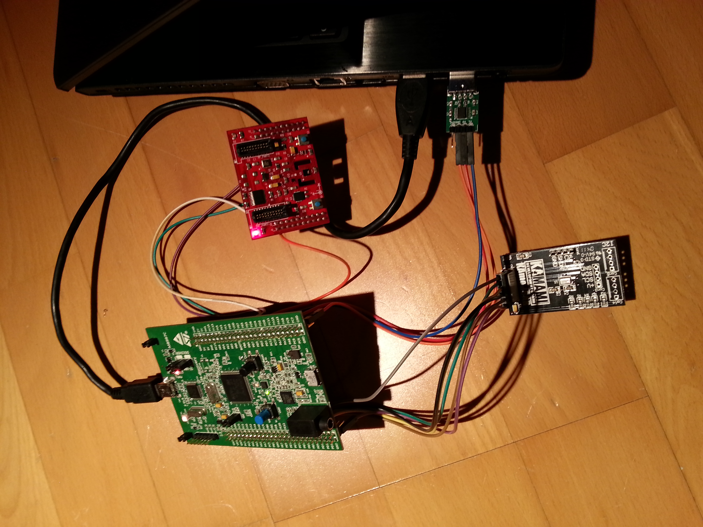

# Barometer - STM32

Purpose of the project was to connect [STM32F4 Discovery](datasheets/STM32F4_Discovery_User_manual.pdf) board to two pressure sensors:
* [BMP180](datasheets/BMP180_datasheet.pdf) placed on [BOOSTXL-SENSHUB](datasheets/BOOSTXL-SENSHUB_User_manual.pdf) board
* [MPL115A1](datasheets/MPL115A1_datasheet.pdf) placed on [KAmodBAR-SPI](datasheets/KAMODBAR-SPI.pdf) board

perform some measurements and compare both sensor.

STM32F4 Discovery board has STM32F407VGT6 microcontroller with ARM Cortex-M4 core. The board also includes ST-LINK/V2 debugger and multiple sensors which are not used in this project.  
To communicate with PC I used UART interface. Between Discovery board and PC there was a simple [USB/UART converter](datasheets/USB-UART_converter.pdf). All output from board could be easily read in terminal application.  
Schematic of all connections between boards is [here](schematic.pdf).

Specification taken from datasheets:

|                             | MPL115A1          | BMP180           |
| --------------------------- |:-----------------:| :--------------: |
| Range                       | 500-1150 hPa      | 300-1100 hPa     |
| Accuracy                    | ±10 hPa           | ±0,12 hPa        |
| Resolution                  | 1.5 hPa           | 0.01 hPa         |
| Interface                   | SPI               | I²C              |
| Supply voltage              | 2.375 V – 5.5 V   | 1.8 V – 3.6 V    |
| Operating Temperature Range | -40 °C to +105 °C | -40 °C to +85 °C |
As we can see datasheets declare that BMP180 is much better than MPL115A1.

## Software

Software for STM32 uses STM32CubeF4 1.13.0 libraries and files generated by STM32CubeMX 4.16.0 application.  
Procedure of measuring pressure was based upon sensors datasheet.

First thing is to read calibration coefficients stored inside both of sensors. These coefficients are unique for every piece of sensor. They are read once, at the program initialization. They will be needed later.

Second thing is to send control command to sensor so it will start temperature and pressure conversion (both sensors measure temperature because it is necessary for correct pressure calculation).  
In case of MPL115A1 there is one command which starts conversion of both pressure and temperature. After 3 ms both values are ready and can be read from sensor.  
In case of BMP180 there are separate commands for pressure and temperature conversion. Both conversions store measured value inside the same register so it have to be read after each conversion. Conversion time for temperature equals 4.5 ms. In case of pressure, conversion command contains value specifying accuracy of measurement. It is called oversampling rate and it ranges between 0 and 3. Conversion time depends on this value and ranges between 4.5 ms and 25.5 ms.  
In this project I used simple delay function to wait for an end of pressure and temperature conversions. Because of simplicity of program this approach works correctly. For more complex applications delay functions are unacceptable and different methods should be used (e.g. interrupts).

After successful conversion, correct value of pressure has to be calculated. Formulas are given in datasheets. For these calculations all data previously read from sensor is used: pressure, temperature and coefficients. As a bonus, correct value of temperature measured by BMP180 sensor can also be calculated. Thanks to proper formula inside datasheet.

To increase accuracy, arithmetic mean value is calculated of every 16 measurements. Afterwards, values are sent to PC by UART interface.  
After each measurement, state of LEDs on Discovery board is changed so the light jumps and draws circlelike shape.  
There is also simpe error handling implemented. If error occurs (e.g. connection between Discovery board and sensor brokes), program will stop performing measurements and will blink onboard LEDs.
